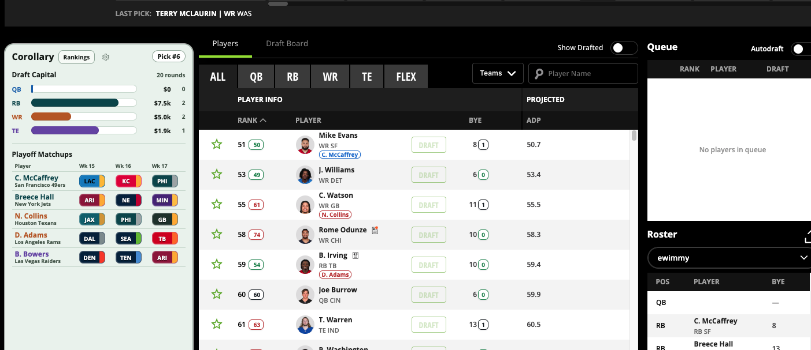

# Corollary

Corollary is a Chrome extension for best ball drafts. Lets you see team composition, playoff correlation, and rankings at a glance.



## What it is

Corollary is an for live DraftKings and Underdog best ball drafts. It puts team context on the draft board, so drafters can draft the most competitive teams.

It starts with roster construction: how much draft capital has gone into each position and what the current roster looks like. From there, Corollary adds decision support without trying to make the pick for you:

- external or custom player rankings next to the live player rows
- draft capital bars for QB, RB, WR, and TE
- drafted-player and available-player context
- stack and correlation targets based on team relationships
- bye-week counts and playoff opponent context for rostered players
- a compact draft queue and roster view that stays in the draft room

The goal is simple: make the next decision easier to understand in a few seconds. The UI is intentionally dense and no-nonsense because this is a tool for an active draft, not a dashboard you browse leisurely.

## How it works

Corollary scans the live draft page, saves information about your picks, and makes it useful.

Step by step:
1. A platform adapter mounts the content on the DOM. There are separate adapters for DraftKings and Underdog because their sites are different.
2. Corollary reads the current user pick, roster rows, available-player rows, rankings, ADP, teams, positions, and bye weeks from the rendered DOM.
3.  Watches for draft-room changes. When a player is drafte, Corollary shows updates in the overlay.
4. Corollary then applies the decision layers: ranking annotations, bye-week counts, stack targets, draft capital, and playoff schedule information.


## Run it locally

Depends on node.js and chrome
```bash
cd app
npm install
npm run build
```

Then load the built extension:

1. Open `chrome://extensions` (or the equivalent extensions page in your Chromium browser).
2. Enable **Developer mode**.
3. Choose **Load unpacked** and select `app/dist` from this repository.
4. Open a supported DraftKings or Underdog draft page and refresh it if the overlay does not appear immediately.

The build output is produced in `app/dist`. During development, `npm run dev` runs Vite in watch mode and rebuilds the extension as source files change; reload the unpacked extension and refresh the draft page to pick up a new build.

## Scripts

From `app/`:

```bash
npm run build       # type-check and create the extension bundle
npm test            # run the Vitest suite once
npm run test:watch  # keep the test suite running while editing
npm run dev         # rebuild continuously with Vite
```

## Project shape

```text
app/src/content/       DOM adapters, refresh pipeline, annotations, storage
app/src/panels/        React overlay UI and visualizations
app/src/data/          schedule and team data
app/src/rankings/      custom ranking import and persistence
app/test/              DOM and logic tests
app/manifest.json      Manifest V3 permissions and host matches
```

